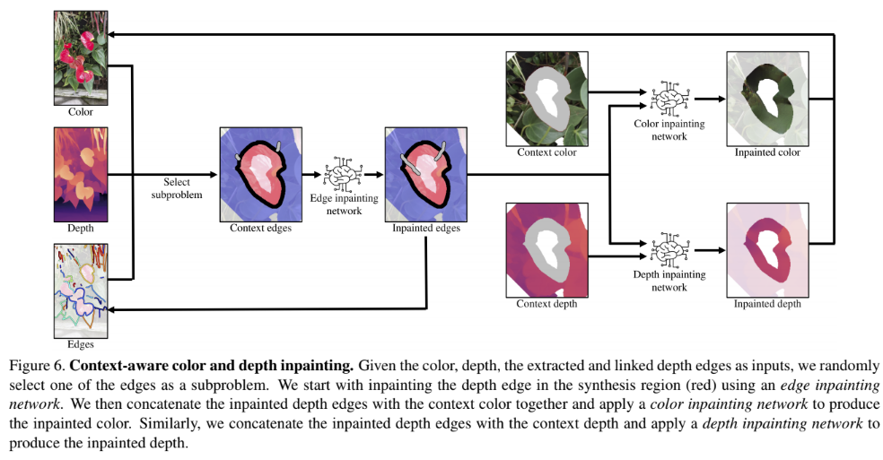

# The brief survey of the 3D video reconstruction for looking glass
In this article, I will explain overview of the methods to create 3D Videos for looking glass.
This article is for the people who want to create apps to create 3D Videos and not for app users.
The target video is any kind of video, for a video where multiple people is moving as a foreground and foreground is fixed, the method I implemented in [remimi](https://github.com/xiong-jie-y/remimi) can be used. I will explain the method in another article.

Firstly I will explain video format we want to output, and secondly the methods that is useful to output the video.

## 3D Video Format we adopt
Before explaining video format, I explain apps available.
There are some apps for looking glass.

To play 3D Videos on looking glass, you can use [HoloPlay](https://docs.lookingglassfactory.com/3d-viewers/holoplay-studio) Studio. 

The supported video formats are

* Quilt Video
* RGBD Video

The format is really simple, quilt video contains images rfom all the views per frame and RGBD video contains a rgb image and a depth image per frame. 

The software only supports windows and mac. For ubuntu, you need to write your quilt video player. I recommend using Unity Plugin because it mostly requires just clicking and few types.

To record these videos, there's a [DepthRecorder](https://docs.lookingglassfactory.com/artist-tools/depth-recorder).
This only supports azure kinect on Windows, but you can record RGBD video using this software.

The quilt video format allow us to put more algorithm, meaning there's more room to improvement.
So I chose quilt video generation for it.

## The research survey for quilt video generation
Quilt video contains quilt image per frame. 
Quilt image is a collection of images from views of horizontally different angles.
Thus to generate this quilt image, we need to prepare images from horizontally different views.

I surveyed researches for the sensor configurations that can be constructed within $1000 USD cost.

### End-to-End View Synthesis from single or two rgb image
There are some researches that synthesis novel view images from a single view or two views (stereo camera) in a end to end manner.

Google's models output a MPI image and from the MPI image novel view image is synthesized. The MPI image is lightweight expression of a scene of thin layer and can be used to render novel view images fast. There are methods for [stereo images](https://github.com/google/stereo-magnification) and [a single image](https://openaccess.thecvf.com/content_CVPR_2020/papers/Tucker_Single-View_View_Synthesis_With_Multiplane_Images_CVPR_2020_paper.pdf).
The two images below are the network structure for stereo images and a single image each.
These networks output MPI images and novel view images are rendered from MPI images.

Facebook's [Synsin](https://arxiv.org/pdf/1912.08804v2.pdf) approach predict a rgb image given a rgb image and a relative pose to the input rgb image. The model is depicted in the image below.

All of the model is trained on limited dataset (few number of indoor and outdoor dataset), 
but the facebook's Synsin model is more generalizable than other models from the evaluation result of training the model on outdoor dataset and test on indoor dataset. These are the images from the facebook's animation. Dis-occluded region is dirty and apparent. Look at the [original GIF](https://github.com/facebookresearch/synsin) for check.
These hallucinated regions are a bit dirtier than the single inpainting methods,
but it's not a big difference when applying to video, because they both don't have a consistency between video frames.

I guess that this model learn's something like how to inpaint the dis-occluded region from the viewpoint change.

The demo of the facebook model seems not perfect, 
but it might be used to video on narrower HFOV 3D monitors like Looking Glass.
Also this is a good starting point for the 3D video generator for any videos.

### Hand crafted view synthesis from single RGB or RGBD image
Hand crafted way is firstly convert into point cloud and render point cloud from different views for quilt image generation. It is easy to create quilt image from RGBD 
because there's already depth channel and point cloud can be reconstructed.
We can just generate quilt video from the point cloud by moving virtual camera horizontally.
For an RGB image, the Depth channel can be estimated from monocular depth estimation methods like DPT.

For this approach, one of the two primary problem we want to solve is inpainting of dis-occluded region and boundary problem.

#### Inpainting of dis-occluded region

There are two ways of inpainting, inpainting depth channel and rgb channels separately or jointly.

In ["3D Ken Burns Effect from a Single Image"](https://github.com/sniklaus/3d-ken-burns), they constructed two networks. One is the network to extract context region used for inpaint, and the other network is inpainting network that output inpainted RGBD image given RGBD image and context vector.

In ["3D Photography using Context-aware Layered Depth Inpainting"](https://shihmengli.github.io/3D-Photo-Inpainting/), the inpainting process has two stages as you can see in the figure below.Two RGBD inpainting method is not thoroughly evaluated, but from the inpainted images, second one seems better. The reason might be that the inpainting model utilize edge in the second method and it preserves edge better. Firstly edge image is inpainted and inpainted edge is given to to the second network along with RGB channel and depth channel.

Two RGBD inpainting method is not thoroughly evaluated, but from the inpainted images, second one seems better. Either of these inpainting method is the method for single image and applying to video might cause flickering of depth and color channel. It's ok for a single image 3d reconstruction, but it might not be enough for 3d video generation.

#### Boundary of the objects

Another problem is boundary, with most of the depth estimation method, boundary is not clear.
Also boundary is very sparse and there's continuity between background and objects.
These point looks garbages when seeing 3d monitors.

One of the solution is simple filters, but it doesn't fully solve the problem and another solution will be the reconstruction based on the knowledge of objects.
For example, there's many way to reconstruct an human 3d mesh from single RGB image using the knowledge of the human shape. For example, [PiFU](https://github.com/facebookresearch/pifuhd) learns human shape and reconstruct an high resolution human mesh from a single RGB image.
[SMPL](https://files.is.tue.mpg.de/black/papers/SMPL2015.pdf) is a parameterized body shape constructed from data, and often used by the model to extract body mesh shape from a single RGB image. Currently it is difficult to model the clothed people, and one of the successful method is [SCANimate](https://scanimate.is.tue.mpg.de/).

It seems that there's still need to be advances for handling boundary of the objects. 

## Conclusion
Currently [Synsin](https://arxiv.org/pdf/1912.08804v2.pdf) seems the balanced and well performing method to synthesize novel views from wide range of images and videos.

For a better quality, I might take either of ways.

* Increase data for synsin and train them more. (more than 3-6 days for one training.)
* Try handcrafted way using multiple models.

Either of it seems difficult, but I will try after implementing Synsin.