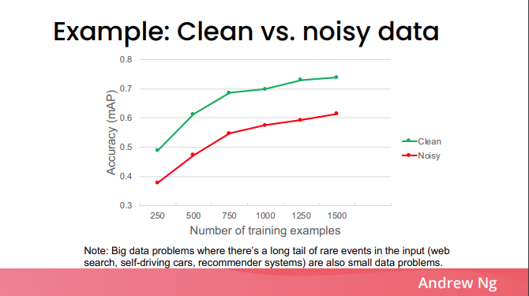

# What dataset construction article?
The dataset construction is important to train a good ML model. 

Both the quality and the quantity is really important for the dataset.
The mediapipe's hand keypoint detection model is trained with more than 100000 synthetic CG images and real images. But it's still not perfect and if you need more performance you need to collect more data with high quality annotation. Also the image below shows that the better quality data result in a better performance model. (from [this slid](https://www.deeplearning.ai/wp-content/uploads/2021/06/MLOps-From-Model-centric-to-Data-centric-AI.pdf)e). 

Achieving both quality and quantity is sometimes difficult for some tasks.
To increase the number of the annotated data, it will take time linearly increased to the number of annotated data.
If the number of the data is increased, the quality control of the annotation will take more time. So both achieving quality and the quantity costs a lot.

Thus if your responsibility is getting a good model, it is worth taking time to learn how to construct an dataset efficiently and with a good quality for various tasks. For this purpose I wrote an article about dataset construction for each task from research and industries.